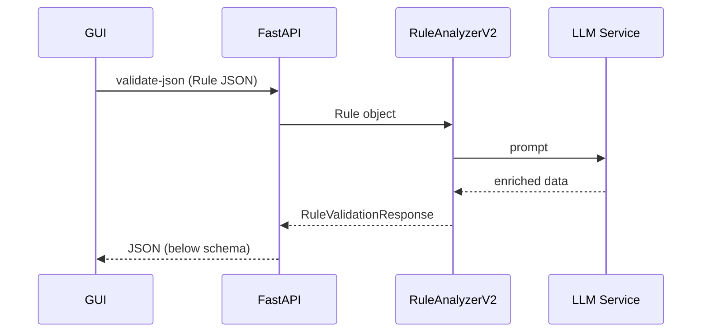

# Rule Validation Response 스키마 상세 설명

> **Spec-Version**: 1.1  |  Last-Update: 2025-06-18  
> **Endpoint**: `POST /rules/validate-json` → returns **RuleValidationResponse**

---

## 0. 개요 / Overview

아래 스키마는 *GUI ↔ FastAPI ↔ RuleAnalyzerV2* 파이프라인의 최종 결과물을 표현합니다.  
LLM 호출을 통해 **AI 생성 콘텐츠**가 주입되므로, *프론트엔드*는 해당 필드 존재 여부를 **동적 체크** 해야 합니다.



---

## 1. 최상위 필드(16개) 개요

| # | 필드 | 타입 | 설명 | AI 생성 여부 |
|---|-------|------|-------|--------------|
| 1 | `is_valid` | `boolean` | 룰이 유효한지 여부 | - |
| 2 | `summary` | `string` | 전체 분석 요약 문장 | - |
| 3 | `issue_counts` | `object` | 이슈 타입별 건수 집계 | - |
| 4 | `issues` | `array<ConditionIssue>` | 발견된 이슈 상세 목록 | - |
| 5 | `structure` | `StructureInfo` | 룰 트리 구조 메트릭 | - |
| 6 | `ai_comment` | `string \| null` | 💡 AI 한줄 코멘트 | **AI** |
| 7 | `field_analysis` | `array<FieldAnalysis>` | 필드별 분석 정보 | - |
| 8 | `logic_flow` | `LogicFlow \| null` | 논리 흐름 분석 | - |
| 9 | `performance_metrics` | `PerformanceMetrics \| null` | 실행 성능 메트릭 | - |
|10 | `quality_metrics` | `QualityMetrics \| null` | 유지보수/가독성 등 품질 | - |
|11 | `report_metadata` | `ReportMetadata \| null` | 분석·리포트 메타데이터 | - |
|12 | `ai_insights` | `object \| null` | 💡 AI 추가 통찰 | **AI** |
|13 | `improvement_recommendations` | `array<object> \| null` | 💡 AI 개선 권고 | **AI** |
|14 | `risk_assessment` | `object \| null` | 💡 AI 위험 평가 | **AI** |
|15 | `complexity_score` | `integer` (0-100) | 전체 룰 복잡성 점수 | - |
|16 | `ai_summary_md` | `string \| null` | 💡 Rich Markdown Summary | **AI** |

> ⚠️ **AI 생성 필드**: `ai_comment`, `ai_insights`, `improvement_recommendations`, `risk_assessment`, `ai_summary_md` 그리고 `issues[*].ai_explanation`·`ai_suggestion`.

---

## 1-A. 샘플 전체 JSON (축약)
```jsonc
{
  "is_valid": false,
  "summary": "2 warnings, 1 error detected (type_mismatch)",
  "issue_counts": {"type_mismatch": 1, "missing_condition": 1},
  "issues": [
    {
      "condUuid": "123e4567-e89b",
      "keyName": "credit_score",
      "issue_type": "type_mismatch",
      "severity": "error",
      "location": "0.1",
      "explanation": "숫자 필드에 문자열 값 사용",
      "suggestion": "숫자 값으로 수정",
      "ai_explanation": "Numeric comparison expects int or float …",
      "ai_suggestion": "Convert value to integer before evaluation",
      "impact_level": "high"
    }
  ],
  "structure": {"depth": 3, "condition_node_count": 7, "field_condition_count": 4, "unique_fields": ["credit_score"]},
  "ai_comment": "⚠️ 데이터 타입 오류는 룰 전체 실행 실패를 초래할 수 있습니다",
  "field_analysis": [],
  "logic_flow": null,
  "performance_metrics": {"estimated_execution_time": "≈1.2 ms", "complexity_rating": "moderate"},
  "quality_metrics": {"maintainability_score": 78, "readability_score": 82, "completeness_score": 90, "consistency_score": 85, "overall_score": 84},
  "report_metadata": {"analysis_timestamp": "2025-06-18T08:15:30Z", "analysis_version": "2.1", "validation_model": "gpt-4o", "validation_ai_latency_ms": 1423},
  "ai_insights": {"root_cause": "User input schema mismatch"},
  "improvement_recommendations": [{"title": "데이터 타입 일치", "recommendation": "Integer 필드에 정수 값만 전달하도록 프론트엔드 입력 검증 추가"}],
  "risk_assessment": {"risk_level": "medium"},
  "complexity_score": 72,
  "ai_summary_md": "### Rule Health\n* ⚠️ **1 Error** – type mismatch …"
}
```

---

## 2. 상세 구조

### 2.1 ConditionIssue (issues 배열 원소)
| 필드 | 타입 | 설명 | AI 생성 여부 |
|------|------|------|--------------|
| `condUuid` | `string \| null` | 조건 고유 ID | - |
| `keyName`  | `string \| null` | 조건 키(필드명) | - |
| `issue_type` | `string` | 이슈 종류 (`missing_condition`, `type_mismatch` 등) | - |
| `severity` | `string` | 심각도 (`error`, `warning`, `info`) | - |
| `location` | `string` | 룰 내 조건 위치 설명 | - |
| `explanation` | `string` | 사람이 이해하기 쉬운 설명 | - |
| `suggestion` | `string` | 개선 제안 | - |
| `ai_explanation` | `string \| null` | 💡 AI 추가 설명 | **AI** |
| `ai_suggestion` | `string \| null` | 💡 AI 개선 제안 | **AI** |
| `impact_level` | `string \| null` | 영향도 (`low`, `medium`, `high`) | - |
| `affected_scenarios` | `array<string> \| null` | 영향을 받는 시나리오 예시 | - |

### 2.2 StructureInfo
```
{
  "depth": 3,
  "condition_count": 4,
  "condition_node_count": 7,
  "field_condition_count": 4,
  "unique_fields": ["MBL_ACT_MEM_PCNT", "MRKT_CD"]
}
```
* **depth**: 가장 깊은 중첩 레벨 (루트=1)
* **condition_node_count**: 논리 연산자 포함 노드 총계
* **field_condition_count**: 실제 비교 조건 수

### 2.3 FieldAnalysis (배열 원소)
```
{
  "keyName": "MBL_ACT_MEM_PCNT",
  "field_type": "Number",
  "condition_count": 2,
  "operators_used": [">=", "<"],
  "values_range": {"min": 0, "max": 100, "examples": [0, 50, 100]},
  "issues_count": 1,
  "complexity_score": 12,
  "condition_uuids": ["abc-123", "def-456"]
}
```
* **values_range**는 숫자·날짜 필드에서만 나타날 수 있으며, 예시 값 포함.

### 2.4 LogicFlow
```
{
  "logical_operators": {"AND": 5, "OR": 2},
  "nesting_levels": [3, 2, 1],
  "branch_coverage": {"covered": 85, "total": 100},
  "potential_dead_code": ["uuid-999"]
}
```

### 2.5 PerformanceMetrics
| 필드 | 설명 |
|------|------|
| `estimated_execution_time` | 룰 처리 예상 시간(문자열, 예: "≈ 2.7 ms") |
| `complexity_rating` | `simple`/`moderate`/`complex`/`very_complex` |
| `optimization_opportunities` | 최적화 아이디어 리스트 |
| `bottleneck_conditions` | 성능 병목 원인 condUuid 배열 |

### 2.6 QualityMetrics
5가지 0-100 점수(높을수록 우수)

### 2.7 ReportMetadata
| 필드 | 설명 |
|------|------|
| `analysis_timestamp` | ISO-8601 분석 시각 |
| `ruleUuid` / `ruleName` | 원본 룰 식별용 |
| `analysis_version` | 분석 알고리즘 버전 |
| `total_analysis_time_ms` | 분석 소요 시간(ms) |

### 2.8 AI 전용 필드
* **ai_comment**: 한 줄 요약식 조언. 간결하지만 핵심을 찌름.
* **ai_insights**: 자유 형태 JSON. 패턴 탐지, 위험 시그널 등을 포함.
* **improvement_recommendations**: 배열 형태 권고 사항. 
  ```json
  [
    {"title": "OR 조건 병합", "recommendation": "같은 필드의 OR 비교는 IN 리스트로 대체해 단순화하세요."}
  ]
  ```
* **risk_assessment**: 시스템 또는 서비스 관점 위험 분석.

> ⚠️ **주의**: AI 생성 필드는 LLM 응답에 따라 변경·누락될 수 있습니다. <br/>프론트엔드는 JSON 필드 존재 여부를 확인한 뒤 조건부 렌더링하세요.

---

## 3. 이슈 유형 7가지

| 이슈 타입 (`issue_type`) | 기본 심각도 | 의미 / 발생 조건 | 대표 예시 |
|-------------------------|-------------|------------------|-----------|
| `duplicate_condition` | `warning` | 동일한 필드·연산자·값의 조건이 룰 트리 내 여러 위치에 **중복**으로 존재 | `age >= 18` 조건이 AND 블록과 OR 블록 양쪽에 반복 |
| `type_mismatch` | `error` | 필드 데이터 타입과 값 타입이 **불일치** | 숫자 필드 `amount`에 문자열 값 `'ten'` 사용 |
| `invalid_operator` | `error` | 필드 타입에 허용되지 않는 **잘못된 연산자** 사용 | 문자열 필드에 `>` 비교 연산자 적용 |
| `self_contradiction` | `error` | 동일 필드에 서로 **모순**되는 조건이 공존 | `score > 50` AND `score < 30` |
| `missing_condition` | `warning` | 필드 값 범위 또는 상태에 대한 **누락된 조건**이 존재 | 0~100 범위 필드에 0 처리 누락 |
| `ambiguous_branch` | `warning` | 복잡한 OR/AND 조합으로 인해 **분기가 불명확**하거나 일부 값이 어느 브랜치에도 매칭되지 않음 | 세부 조건 누락으로 dead branch 발생 |
| `complexity_warning` | `info` | 룰 복잡성 점수가 임계치(예: 70) 이상으로 **과도하게 복잡** | 조건 100개 이상, 중첩 깊이 6 이상 |

> 💡 **AI 보강**: 각 이슈 항목에는 `ai_explanation`, `ai_suggestion`이 포함될 수 있어, 
> 사람이 이해하기 어려운 논리적 결함이나 리팩토링 방향을 자연어로 제시합니다.

---

## 4. 활용 가이드
1. **대시보드 요약** → `is_valid`, `summary`, `complexity_score`를 헤드라인으로 표시.
2. **세부 이슈 테이블** → `issues` 배열 + `issue_counts` 집계로 필터/색상 구분.
3. **AI 조언** → `ai_comment`는 알람, `improvement_recommendations`는 액션아이템 카드식 표시.
4. **Analytics 차트** → `structure`, `logic_flow`, `quality_metrics` 등을 각각 그래프로 시각화.

---

> 마지막 업데이트: 2025-06-12 