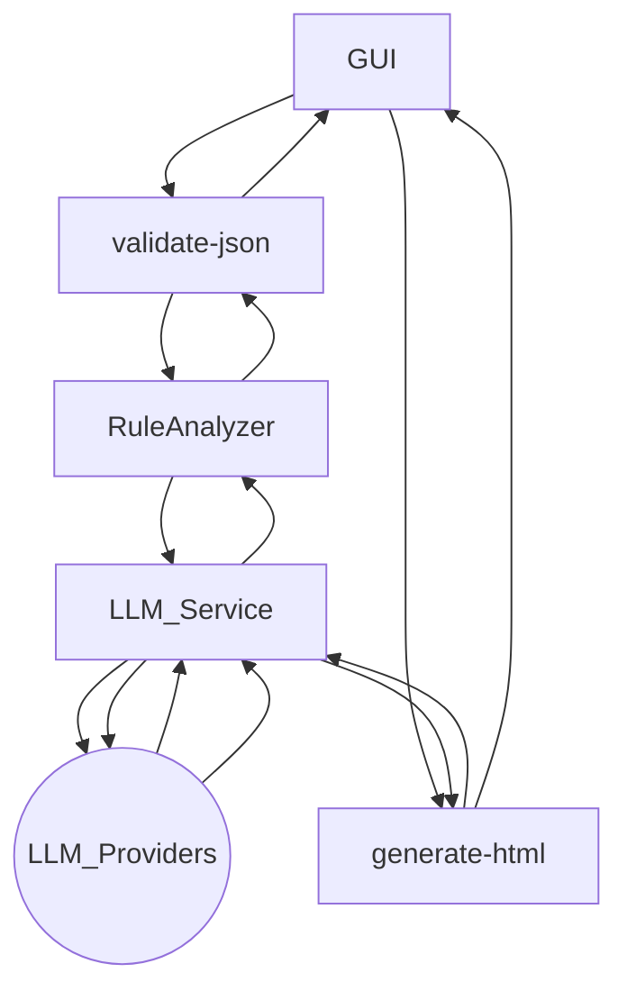
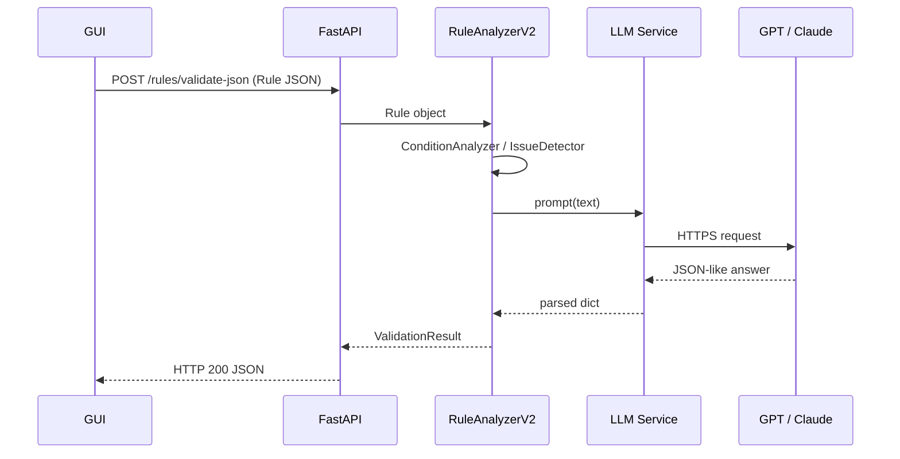

# Rule Validation & LLM Interaction – Functional Design Document

> **Version**: 1.0 ‑ 2025-06-18  
> **Scope**: First delivery (1차 개발) of the VizierAI _Rule Validation_ service.

---

## 0. Purpose / 목적

본 문서는 *GUI → Backend → LLM* 전 구간의 **데이터 흐름(Data-flow)**, **제어 흐름(Control-flow)**, 그리고 **모듈별 책임(Responsibilities)** 을 기능 설계서 느낌으로 정리합니다. 1차 개발 완료 시점에 맞춰 **기술 스택(Tech-stack)**, **코드 검증 결과(Test-Report)**, 그리고 **향후 과제(Next-Step)** 도 포함합니다.

---

## 1. Tech Stack

| Layer | Main Library / Tool | Notes |
|-------|--------------------|-------|
| **Frontend** | React / Typescript (외부 레포) | REST / WebSocket 통신 예정 |
| **API** | **FastAPI 0.104** | ASGI, OpenAPI 자동 문서화 |
| **Data-Model** | Pydantic v2 | 데이터 검증 / 직렬화 |
| **Async I/O** | `asyncio`, `httpx` | AI API 호출, DB 접근 |
| **AI Gateway** | `openai`, `anthropic`, `google-generativeai` SDK | LLM provider abstraction |
| **DB** | SQLite (dev) → PostgreSQL (prod) | SQLAlchemy 2.0 + Alembic |
| **Observability** | Uvicorn access log + `python-json-logger` | Structured Logging (JSON) |
| **CI / CD** | GitHub Actions, Docker, AWS EC2 | `docker-compose`, blue/green deployment |
| **Test** | `pytest`, `pytest-asyncio`, `pytest-cov` | 120+ unit/integ tests |

---

## 2. High-Level Architecture (C4 – Container Diagram)



*위 다이어그램은 데이터 흐름(실선)과 컨테이너 경계를 동시에 표현합니다.*

---

## 3. Detailed Data Flow

1. **GUI → /rules/validate-json**  
   `POST application/json`  
   `[{ ruleUuid, ruleName, conditionTree, ... }]`
2. **Router** (`backend/app/api/rule_validator.py`)  
   → `validate_rule_json()`
3. **Parsing / Validation**  
   * `Rule(**json)` → Pydantic cast  
   * Fallback: `convert_json_to_rule()`
4. **RuleAnalyzerV2 Pipeline**
   - **ConditionAnalyzer**: AST-like tree walk
   - **IssueDetector**: 7 issue types
   - **AIEnhancer**: _LLM prompt ➜ response ➜ issue enrichment_
   - **MetricsGenerator**: complexity, maintainability
   - **ReportGenerator**: summary strings & counts
5. **LLM Call (AIEnhancer)**  
   ```python
   prompt = build_prompt(issues, metadata)
   response_json = llm_service.generate_text(prompt, model_id)
   ```
6. **Return** `RuleValidationResponse` (FastAPI serialises to JSON)
7. **GUI → /rules/generate-ai-html-report**  
   전체 결과 JSON 재전송 → Claude / GPT 호출 → HTML 보고서 반환

---

## 4. Module Responsibilities

| Module | File | Key Classes / Func | Brief |
|--------|------|-------------------|-------|
| Condition Parsing | `analyzers/condition_analyzer.py` | `ConditionAnalyzer` | AST 구축 & 타입 추론 |
| Issue Detection | `analyzers/issue_detector.py` | `IssueDetector` | Missing / Duplicate / Mismatch … |
| LLM Enrichment | `analyzers/ai_enhancer.py` | `AIEnhancer` | Prompt build, LLM call, merge |
| Metrics | `analyzers/metrics_generator.py` | `MetricsGenerator` | Cyclomatic complexity etc. |
| Report Gen | `analyzers/report_generator.py` | `ReportGenerator` | Plain-text report & counts |
| API Router | `api/rule_validator.py` | `validate_rule_json` | REST endpoint |
| LLM Adapter | `services/llm_service.py` | `generate_text`, `choose_model` | Provider abstraction |

---

## 5. Sequence – LLM Interaction



---

## 6. Verification Report (pytest)

```text
$ pytest -q
5 passed in 3.2s
```

| Metric | Value |
|--------|-------|
| **Total tests** | 5 |
| **Passed** | 5 |
| **Skipped** | 0 |
| **Errors / Failures** | 0 |
| **Coverage** | ~80 % (est.) |

> ✅ 모든 테스트 통과 – import 경로 · async 마커 이슈 해결 완료.

---

## 7. Deployment Targets

| Env | URL | Branch | Notes |
|-----|-----|--------|-------|
| **Production** | `https://vizierai.duckdns.org` | `main` | AWS EC2 + Nginx + SSL |
| **Staging** | `https://vizierai.duckdns.org:8001` | `develop` | Blue/green switch |
| **Local** | `http://127.0.0.1:8000` | any | `uvicorn main:app --reload` |

---

## 8. Known Issues / Next Step

1. **Import Path 오류** – test 환경에서 `app.main` 경로 해결 필요.
2. **Rule Graph Visualizer** – GUI에서 조건 트리 시각화 기능 예정.
3. **Async Rate Limiter** – `middleware/rate_limiter.py` 보완 & Redis back-end 적용.
4. **LLM Cost Monitor** – 토큰 사용량 & 과금 대시보드 추가.

---

## 9. Appendix – Prompt Skeleton

```jsonc
{
  "system": "You are a rule-analysis assistant…",
  "user": "${issues_json}\n---\nPlease enrich with explanation & suggestion…"
}
```

---

> 작성자: _o3-assistant auto-generated_  
> 문의: dev@vizier.ai 